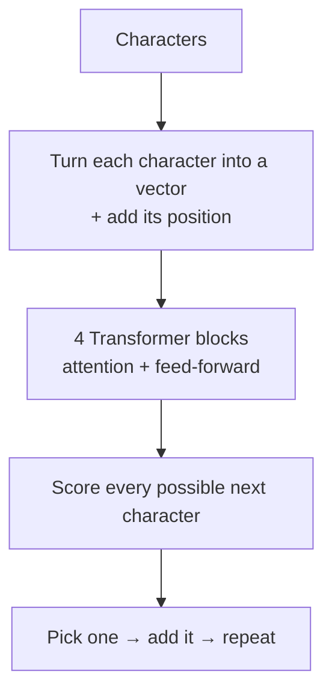
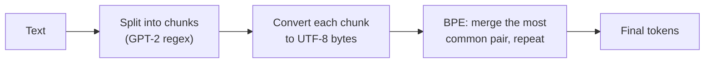

<div align="center">

# 🧠 Handbuilt Transformer

**A mini GPT and a mini GPT tokenizer, built from scratch in PyTorch.**


</div>

---

## 📌 What is this?

ChatGPT works in two steps:

1. A **tokenizer** chops text into small pieces (tokens) and turns them into numbers.
2. A **Transformer** reads those numbers and predicts what comes next.

I built a small version of both, by hand, to understand how they really work.

| Notebook | What it does |
|---|---|
| 🧠 `Transformers_Architecture.ipynb` | A small GPT-style model that learns from Shakespeare and writes new Shakespeare-like text |
| ✂️ `Tokenization.ipynb` | A tokenizer that learns to merge common letter pairs into tokens, the same idea used by ChatGPT's tokenizer (`tiktoken`) |

---

## 🧠 Part 1 — The Transformer

### How it works

The model reads a piece of text one character at a time and tries to guess the **next character**. After seeing enough Shakespeare, it gets good at guessing — and if you keep feeding its guesses back in, it writes new text.

```text
"To be or not to b"  →  model  →  "e"
```



**Inside each Transformer block:**
- **Self-attention** — each character looks back at the earlier characters to decide what matters. A *causal mask* stops it from peeking at future characters.
- **Multi-head attention** — 4 attention "heads" run side by side, each free to notice different patterns.
- **Feed-forward network** — a small neural network that processes what attention found.
- **Residual connections + LayerNorm** — shortcuts and normalisation that keep training stable.

### Model settings

| Setting | Value | In simple words |
|---|---|---|
| Context length | 32 | How many past characters the model can see |
| Embedding size | 64 | How many numbers describe each character |
| Attention heads | 4 | Parallel "looks" at the text |
| Transformer blocks | 4 | How many layers are stacked |
| Dropout | 0.2 | Randomly switches off parts while training to avoid memorising |
| Batch size | 32 | Text snippets processed at once |
| Training steps | 5,000 | Optimizer: Adam, learning rate 0.001 |
| Parameters | ~0.21 million | (GPT-3 has 175 billion) |

### Results

Loss measures how wrong the model's guesses are — lower is better.

| | Start | After 5,000 steps |
|---|---|---|
| Training loss | 4.41 | **1.66** |
| Validation loss | 4.40 | **1.82** |

**Real sample from the model:**

```text
SOMERD:
Whot to wookevent, but seech, queet to withis ank to upornsonhfres,
For migstannown Ise is aredienuon,

MARK:
We thee, to for this watch ove patiinour could you fait; her?
And, over but, and good Coapleechs,
That the Louchiand and wold mean,
Pans! that I'll stays not and it Bostral;
```

The model learned the *shape* of a Shakespeare play — character names in capitals, short lines, punctuation, and many real English words — even though the meaning doesn't hold together. That's expected for a tiny model that only sees one character at a time.

---

## ✂️ Part 2 — The Tokenizer

### Why do we need one?

Reading text one character at a time (like Part 1) is slow — sequences get very long. Real models like GPT group common pieces of text into single tokens, so `" the"` can be **one** token instead of four.

### How it works



**1. Split text into chunks (GPT-2 style).** Before anything else, the text is cut into chunks using the same regex pattern as GPT-2. It separates words, numbers, punctuation and spaces:

```text
"Hello've world123 how's are you!!!?"
→ ['Hello', "'ve", ' world', '123', ' how', "'s", ' are', ' you', '!!!?']
```

Why? So a token can never mix a word with the punctuation next to it. Without this, `"dog."`, `"dog!"` and `"dog?"` could all become different tokens. With it, they all share the same `"dog"` token.

**2. Chunks → bytes.** Each chunk is turned into UTF-8 bytes, so any text — English, Hindi, emoji 😄 — becomes numbers between 0 and 255.

**3. Byte Pair Encoding (BPE).** The tokenizer counts which pair of neighbouring tokens appears most often, merges it into a new token, and repeats. Pairs are only counted **inside** a chunk, never across two chunks. Some merges it learned:

| New token | Made from | Meaning |
|---|---|---|
| <!-- TODO --> | <!-- TODO --> | <!-- TODO --> |
| <!-- TODO --> | <!-- TODO --> | <!-- TODO --> |
| <!-- TODO --> | <!-- TODO --> | <!-- TODO --> |

<!-- TODO: one line showing a later merge building on an earlier one, if your output has one -->

**4. Encode and decode.** `encode()` splits new text the same way, turns each chunk into bytes and applies the learned merges. `decode()` turns tokens back into the exact original text. Both were tested and give back the original text perfectly.

I also compared my tokenizer with OpenAI's real `tiktoken` tokenizer for GPT-2 and GPT-4.

### Results

| | Value |
|---|---|
| Training text | *A Programmer's Introduction to Unicode* (Nathan Reed) |
| Vocabulary size | <!-- TODO: 256 + number of merges --> |
| Tokens before BPE | <!-- TODO --> |
| Tokens after BPE | <!-- TODO --> |
| Compression | <!-- TODO -->× fewer tokens |

Real GPT-4 uses ~100,000 merges, so a small vocabulary like this only compresses a little — but the idea is exactly the same.

---

## 💡 What I Learned

- How attention lets a model decide which earlier words matter
- Why the model must not see future characters during training
- How a model writes text by predicting one token at a time

- How BPE turns common letter pairs into tokens to make text shorter
- Why GPT splits text into chunks before tokenizing

---

## ⚠️ Limitations

- The Transformer reads characters, not the tokens from my tokenizer
- The model is tiny, so the text only looks like Shakespeare on the surface
- The tokenizer was trained on one short article with a small vocabulary
- It uses the older GPT-2 split pattern, not GPT-4's

---

## 🔮 Roadmap

- [x] Split text with the GPT-2 regex before BPE training
- [ ] Upgrade to the GPT-4 split pattern
- [ ] Train the Transformer on my BPE tokens instead of characters
- [ ] Add special tokens like `<|endoftext|>`
- [ ] Train a bigger model on more data

---

## 🚀 Run It Yourself

```bash
git clone https://github.com/NaramCharan/Handbuilt-Transformer
cd handbuilt-transformers
pip install torch regex tiktoken jupyter
jupyter notebook
```

Put the Tiny Shakespeare `input.txt` in the same folder, then open either notebook.

---

## 🙏 Acknowledgements

- **Andrej Karpathy** — this project follows his lectures *"Let's build GPT: from scratch, in code, spelled out"* and *"Let's build the GPT Tokenizer"*, and his [minbpe](https://github.com/karpathy/minbpe) repo.
- **OpenAI [`tiktoken`](https://github.com/openai/tiktoken)** — the tokenizer used by ChatGPT, which inspired Part 2.
- **Nathan Reed** — for *A Programmer's Introduction to Unicode*, used as tokenizer training text.
